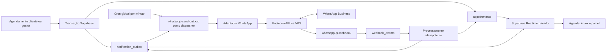

# Reconstrução da automação WhatsApp integrada à agenda

## Fonte de verdade

Este plano substitui integralmente qualquer planejamento anterior da automação Evolution API. Base funcional: `SPEC DEV — Módulo WhatsApp integrado à agenda`, versão 1.0, de 17/08/2026, revisada contra código, migrations e testes atuais.

Nenhuma implementação, migration remota, publicação de Edge Function, alteração na VPS, deploy Vercel ou push GitHub faz parte desta etapa de planejamento.

## Resultado esperado

Construir automação transacional confiável entre agenda e WhatsApp Business conectado por QR Code, mantendo Supabase como fonte de verdade e Evolution API apenas como transporte.

Fluxo final:

1. Cliente ou gestor cria agendamento pela regra de domínio atual.
2. Mesma transação persiste tarefas de automação idempotentes.
3. Cliente e barbeiro recebem mensagens imediatas independentes.
4. Cron global acorda dispatcher a cada minuto.
5. Dispatcher envia confirmação das 08:00 e confirmação T-45.
6. Cliente confirma ou cancela por botão homologado ou texto com código curto.
7. Webhook persiste evento, deduplica e aplica efeito transacional.
8. Agenda, inbox e painel operacional atualizam em tempo real.

## Escopo da v1

Inclui conexão QR existente, mensagens imediatas, confirmação 08:00, confirmação T-45, Confirmar, Cancelar, inbox de texto, envio manual, Realtime, observabilidade, retry e dead letter.

Não inclui refazer QR/instância, n8n, IA/NLP, resposta livre automatizada, opção Reagendar, campanhas/marketing, mídia, pagamentos no WhatsApp, importação de histórico anterior ou migração automática para Meta Cloud API.



## Baseline verificada no repositório

### Preservar

- `supabase/functions/whatsapp-qr-start/index.ts`: criação/reuso da instância estável, geração de QR e configuração do webhook.
- `supabase/functions/whatsapp-qr-status/index.ts`: consulta autenticada do estado da instância.
- `supabase/functions/whatsapp-qr-health/index.ts`: verificação periódica de saúde.
- `supabase/functions/_shared/evolution-qr-webhook.ts`: contrato de configuração do webhook, após reduzir temporariamente os eventos na quarentena.
- `supabase/functions/whatsapp-qr-webhook/index.ts`: tratamento de `QRCODE_UPDATED` e `CONNECTION_UPDATE`.
- `supabase/functions/_shared/whatsapp.ts`: resolução server-side da conexão ativa e envio Evolution por `sendText`, depois dividido por adaptador.
- `supabase/functions/whatsapp-send-outbox/index.ts`: claim, fronteira durável `SENDING` e conclusão do envio imediato, depois evoluído para dispatcher.
- `whatsapp_business_connections`, Vault, estado/saúde da conexão e telefone conectado.
- `notification_outbox`, `message_attempts`, `webhook_events`, `consent_events` e `appointment_status_events` como infraestrutura física reaproveitável.
- `appointments.version` como `automation_version`.
- `organizations.timezone`, `appointments.service_period`, snapshots de itens/valor e constraint de sobreposição.
- `barbers.whatsapp_e164`, normalização E.164 e aviso quando profissional não possui WhatsApp.
- Meta Cloud API inteira. Nenhum endpoint, tabela, credencial, template ou fluxo Meta será removido ou reescrito nesta reconstrução.
- Primeira mensagem Evolution enviada ao cliente após criação do agendamento. Durante quarentena, este será o único envio automático QR preservado.

### Arquivar e desativar no runtime QR

- Lembretes legados de 6 horas e 45 minutos.
- Respostas legadas `1`, `2`, `3` sem código de solicitação.
- Fluxo de reagendamento automático pelo WhatsApp.
- Confirmação de cancelamento em duas etapas do legado.
- Encaminhamento legado de texto livre ao número conectado.
- Alterações de `appointments.whatsapp_response_status` feitas pelo fluxo legado.
- Notificações operacionais legadas ao barbeiro/gestor criadas após resposta.
- `EVOLUTION_REMINDER_BUTTONS`, `CANCEL_CONFIRM_PROMPT` e renderização antiga no sender Evolution.
- Leitura de `MESSAGES_UPSERT` para executar ações antigas.
- Tela de configuração 6h/45m e mensagem de boas-vindas quando o provedor ativo for `QR_WEB`.
- Testes que validam comportamento legado. Serão preservados no arquivo, mas removidos da suíte ativa.

### Não mover nem apagar

Migrations já aplicadas permanecem em `supabase/migrations/`. Histórico remoto não pode ser reescrito. Desativação será feita por nova migration incremental. Campos/tipos legados ficam deprecated até conclusão do piloto; remoção física só ocorrerá em limpeza posterior, com nova autorização.

### Segurança do worktree atual

Antes da implementação, preservar mudanças locais já existentes:

- fora do escopo: `.gitignore`, `HANDOFF.md`, `IMPLEMENTATION_PROMPT.md`, `cloudflare-pages/` e plano Cloudflare;
- candidatas ao archive legado: alterações locais em `supabase/functions/whatsapp-qr-webhook/index.ts`, `tests/integrations/whatsapp-qr-automation.test.ts`, `supabase/functions/_shared/evolution-message.ts`, migration de diagnóstico de identidade e teste correspondente.

Nenhum arquivo local será descartado. Conteúdo WhatsApp não commitado será incluído no snapshot do legado antes de qualquer substituição. Staging futuro será explícito por caminho.

## Resoluções técnicas da revisão

### 1. Fallback textual

A SPEC contém duas formas: opções numéricas e comandos com código. Contrato final:

- mensagem principal pede `1 ABC123` para confirmar;
- mensagem principal pede `2 ABC123` para cancelar;
- parser aceita também `CONFIRMAR ABC123` e `CANCELAR ABC123` como aliases;
- `1`, `2`, `sim`, `não`, `confirmar` ou `cancelar` sem código nunca alteram a agenda;
- código curto é aleatório, expirável, não reutilizável e armazenado como hash;
- texto inválido permanece no inbox para atendimento humano.

Razão: preservar UX numérica sem permitir que resposta antiga ou ambígua afete agendamento errado.

### 2. Estado do agendamento

Não substituir o enum operacional atual. Hoje `appointments.status = CONFIRMED` significa slot reservado e participa da constraint de conflito, pagamentos, reservas e relatórios.

Adaptação segura:

- manter `appointments.status` para ciclo operacional existente;
- adicionar estado próprio de presença/automação: `PENDING`, `CONFIRMED` e metadados de reconfirmação;
- agenda mostra **Agendado** quando slot está reservado e presença está pendente;
- agenda mostra **Confirmado pelo WhatsApp** quando presença foi confirmada;
- cancelamento usa fluxo atômico existente, mantém `appointments.status = CANCELED` e registra `cancellation_source = WHATSAPP_CLIENT` no contrato novo;
- histórico usa `appointment_status_events` com origem, solicitação e mensagem relacionadas.

Isso satisfaz comportamento visual da SPEC sem romper disponibilidade, financeiro ou reservas existentes.

### 3. Tabelas reaproveitadas

| Conceito da SPEC | Implementação física planejada |
| --- | --- |
| `appointment_automation_jobs` | Estender `notification_outbox`; não criar segunda fila. |
| `appointment_status_history` | Estender uso de `appointment_status_events`; não duplicar histórico. |
| `whatsapp_connections` | Estender `whatsapp_business_connections`; preservar Meta e QR. |
| `whatsapp_webhook_events` | Estender `webhook_events` para fingerprint, conexão e retenção WhatsApp. |
| tentativas/status de entrega | Reusar `message_attempts`; relacionar com nova mensagem de inbox. |
| `automation_version` | Reusar `appointments.version`. |
| consentimento | Reusar `consent_events`, verificando preferência mais recente no claim. |

### 4. Tabelas novas necessárias

- `whatsapp_contacts`: identidade por conexão, telefone, JID/LID e vínculo opcional com cliente/barbeiro.
- `whatsapp_conversations`: conversa por tenant, conexão e contato.
- `whatsapp_messages`: inbound/outbound, origem, corpo, estado normalizado, IDs do provedor e vínculos de agenda.
- `whatsapp_confirmation_requests`: etapa, token opaco, código curto, versão do agendamento, validade, resposta e supersessão.
- `whatsapp_message_templates`: templates versionados e validados por tenant.

### 5. Realtime

Usar canal privado e autorizado por tenant. Para agenda e inbox, preferir Supabase Realtime Broadcast com autorização, evitando publicar payload bruto de webhook. Eventos enviados à UI conterão somente IDs, estado e campos mínimos autorizados.

### 6. Botões interativos

Produção inicia com fallback textual. `interactive_buttons_enabled` fica falso por padrão. Botões só serão ativados por conexão depois de homologação real da tag instalada, payload, retorno e webhooks em Android, iOS, Web e Desktop.

Não atualizar VPS para pre-release nem usar `latest` para obter botões. Tag/imagem instalada deve ser registrada e fixada.

## Plano de arquivos

### Arquivo do legado

Criar antes de remover comportamento:

- `docs/archive/whatsapp-evolution-v1/README.md`: motivo, limites, commit-base e regras de restauração.
- `docs/archive/whatsapp-evolution-v1/runtime-before-rebuild.patch`: patch exato do código runtime removido.
- `docs/archive/whatsapp-evolution-v1/database-contracts.md`: funções, triggers, cron, templates e colunas legadas.
- `docs/archive/whatsapp-evolution-v1/tests-before-rebuild.patch`: testes retirados da suíte ativa.
- `docs/archive/whatsapp-evolution-v1/MANIFEST.md`: arquivos, migrations históricas e checksums.

Arquivos do arquivo não usarão extensão executável `.ts`/`.sql`. Next, Deno, ESLint, TypeScript e Vitest não devem carregá-los.

### Runtime preservado/modificado

- `supabase/functions/whatsapp-qr-start/index.ts`
- `supabase/functions/whatsapp-qr-status/index.ts`
- `supabase/functions/whatsapp-qr-health/index.ts`
- `supabase/functions/whatsapp-qr-webhook/index.ts`
- `supabase/functions/whatsapp-send-outbox/index.ts`
- `supabase/functions/_shared/evolution-qr-webhook.ts`
- `supabase/functions/_shared/whatsapp.ts`
- `supabase/functions/maintenance-jobs/index.ts`
- `src/components/connected-manager/whatsapp-settings.tsx`
- `src/components/connected-manager/server.ts`
- `src/components/connected-manager/types.ts`
- `src/components/connected-manager/appointment-display-status.ts`
- `src/components/connected-manager/agenda-manager.tsx`
- `src/app/gestor/configuracoes/whatsapp/page.tsx`

### Novos módulos planejados

- `supabase/functions/_shared/whatsapp-provider.ts`: interface lógica sem formato Evolution/Meta.
- `supabase/functions/_shared/evolution-provider.ts`: envio, consulta e normalização Evolution.
- `supabase/functions/_shared/whatsapp-automation-domain.ts`: cálculo de jobs, validade, dedupe e parser puro.
- `supabase/functions/_shared/whatsapp-webhook-normalizer.ts`: normalização por versão/provedor.
- `supabase/functions/_shared/whatsapp-template-renderer.ts`: renderização segura e validação de variáveis.
- `src/app/gestor/mensagens/page.tsx`: inbox autenticado.
- `src/components/connected-manager/whatsapp-inbox.tsx`: conversas, histórico e envio manual.
- `src/components/connected-manager/whatsapp-operations.tsx`: fila, falhas, dead letter e retry autorizado.

### Migrations futuras

Nomes exatos usarão próximo timestamp disponível após revalidar checkout:

1. `*_whatsapp_qr_legacy_quarantine.sql`
2. `*_whatsapp_automation_v2_foundation.sql`
3. `*_whatsapp_automation_v2_webhooks.sql`
4. `*_whatsapp_automation_v2_reminders.sql`
5. `*_whatsapp_automation_v2_inbox_realtime.sql`
6. `*_whatsapp_automation_v2_operations_rollout.sql`

Cada migration deve ser incremental, tenant-safe, idempotente quando aplicável e sem apagar histórico.

## Fase 0 — Descoberta, arquivo e quarentena

### 0.1 Inventário obrigatório

1. Revalidar branch, SHA, worktree suja e migrations locais/remotas.
2. Preservar mudanças não relacionadas; staging futuro será explícito por arquivo.
3. Consultar, sem alterar VPS:
   - tag/imagem Docker exata da Evolution;
   - provider da instância (`WHATSAPP-BAILEYS` ou equivalente);
   - endpoint de versão/health disponível;
   - contrato real de `sendText` já aprovado.
4. Registrar payloads sanitizados já observados para:
   - criação/conexão QR;
   - `CONNECTION_UPDATE`;
   - resposta síncrona de `sendText`;
   - IDs/JIDs/LIDs devolvidos.
5. Confirmar cron remoto atual, Edge Functions publicadas e variáveis necessárias sem imprimir valores.

### 0.2 Arquivar legado

1. Gerar patches e manifesto em `docs/archive/whatsapp-evolution-v1/` antes de editar runtime.
2. Incluir funções efetivas das migrations antigas:
   - `enqueue_due_whatsapp_reminders`;
   - `process_whatsapp_text_action`;
   - `process_whatsapp_action_token` para QR legado;
   - `forward_unrecognized_whatsapp_message`;
   - branches antigas de `claim_notification_outbox`.
3. Registrar migrations históricas, sem removê-las.
4. Copiar testes legados para patch e retirar expectativas antigas da suíte ativa.

### 0.3 Quarentena incremental

Migration `*_whatsapp_qr_legacy_quarantine.sql`:

- adicionar kill switch QR v2 por tenant e global;
- impedir geração de jobs 6h/45m somente para organizações cujo provedor ativo seja `QR_WEB`;
- manter comportamento Meta inalterado;
- cancelar jobs QR legados `PENDING`/`FAILED` com motivo `LEGACY_QR_AUTOMATION_QUARANTINED`;
- converter `PROCESSING` com lease expirado em estado terminal seguro;
- nunca reenviar `SENDING`/`SEND_UNKNOWN`;
- expirar solicitações/tokens QR legados ainda abertos;
- fazer RPCs de resposta legada recusarem ações QR com `LEGACY_QR_AUTOMATION_DISABLED`;
- desagendar `los_barberos_enqueue_whatsapp_reminders` somente depois de confirmar que nenhuma automação Meta depende dele; se Meta depender, manter cron e filtrar QR no SQL;
- manter cron de envio por minuto, pois primeira mensagem depende dele.

Edge/UI:

- `whatsapp-qr-webhook` processa apenas QR e conexão durante quarentena;
- `MESSAGES_UPSERT` pode continuar chegando, mas retorna 200 sem efeito de agenda até fundação v2;
- configuração por instância passa temporariamente a solicitar somente `QRCODE_UPDATED` e `CONNECTION_UPDATE` em novas reconexões;
- UI QR informa: “Conexão ativa; confirmação inicial ativa; novas automações em reconstrução”;
- esconder controles QR de 6h/45m/boas-vindas;
- preservar UI/fluxo Meta sem mudanças funcionais.

### 0.4 Gate da fase

- QR conecta/reconecta e atualiza status.
- Novo agendamento envia uma única primeira mensagem ao cliente.
- Nenhum job 6h/45m QR é criado ou enviado.
- Resposta antiga não muda agenda.
- Meta mantém testes e contratos atuais.
- Archive restaura código legado em checkout descartável.

## Fase 1 — Fundação de dados, adaptador e mensagens imediatas

### 1.1 Evoluir schema existente

Estender `notification_outbox`:

- `appointment_version`;
- `connection_id` e provider planejado;
- `job_type`;
- `recipient_type` (`CLIENT`, `STAFF`);
- `valid_until`;
- `terminal_reason`;
- `correlation_id`/`confirmation_request_id` quando aplicável;
- status adicionais `SKIPPED` e `DEAD_LETTER`.

Tipos v2:

- `booking_created_client`;
- `booking_created_staff`;
- `reminder_morning_client`;
- `reminder_t45_client`;
- `confirmation_ack_client`;
- `cancellation_ack_client`;
- `appointment_confirmed_staff`;
- `appointment_cancelled_staff`;
- `manual_outbound_text`.

Índices mínimos:

- parcial para claim em estados elegíveis por `next_attempt_at`, `scheduled_at` e `id`;
- parcial por `organization_id` para painel de `FAILED`/`DEAD_LETTER`;
- composto por `appointment_id`, `appointment_version` e `job_type` para cancelamento de versão;
- todos os novos FKs indexados.

Manter `SENDING` como fronteira de incerteza: provedor aceitou, conclusão no banco falhou, então não retentar automaticamente.

Estender `whatsapp_business_connections`:

- `capabilities` com `interactive_buttons_enabled = false`;
- `last_event_at`;
- versão/provider observado;
- dados operacionais sem segredos.

Criar settings v2:

- `automation_enabled`;
- `reminder_mode`: `BOTH`, `MORNING_ONLY`, `T45_ONLY`;
- `morning_local_time = 08:00`;
- `t45_offset_minutes = 45`;
- `send_t45_after_confirm = true`;
- `client_ack_enabled = true`;
- `staff_notifications_enabled = true`;
- `manual_cancellation_message_enabled = false` na primeira entrega;
- `dispatch_paused` como kill switch.

Templates v2 serão versionados, editáveis por tenant, validados antes do envio e exibidos com preview. Variável ausente bloqueia o job com erro de validação; nunca envia `undefined`.

### 1.2 Serviço de domínio único

Refatorar criação cliente e manual para chamar a mesma rotina DB de automação. Trigger pode persistir jobs, mas nunca chamar HTTP.

Na mesma transação do agendamento:

- criar `booking_created_client`;
- criar `booking_created_staff` quando `barbers.whatsapp_e164` for válido;
- criar jobs de lembrete elegíveis para versão atual;
- gerar aviso operacional, sem abortar agendamento, quando telefone do barbeiro faltar;
- usar snapshots de serviço, duração, valor e moeda do agendamento;
- aplicar dedupe `appointment:{id}:v{version}:{job_type}:{recipient_type}`.

Falha de um destinatário não cancela nem duplica outro.

### 1.3 Adaptador

Interface `whatsapp-provider.ts`:

- `sendText`;
- `sendInteractiveConfirmation`;
- `getConnectionState`;
- `normalizeInboundEvent`;
- `normalizeDeliveryEvent`.

`evolution-provider.ts` implementa contrato real da tag instalada. `whatsapp.ts` mantém Meta separado. Regra de agenda não conhece payload Evolution.

### 1.4 Dispatcher

Evoluir `whatsapp-send-outbox` sem criar segundo cron:

- cron global `* * * * *` continua acordando função;
- claim máximo 25 por execução, `FOR UPDATE SKIP LOCKED`;
- no máximo 5 chamadas Evolution concorrentes;
- limite por conexão/tenant para evitar starvation;
- timeout curto;
- retries em 1, 5, 15 e 30 minutos com jitter;
- retry somente antes de `valid_until`;
- 4xx permanente, telefone inválido e payload inválido vão para dead letter;
- desconexão gera retry apenas dentro da janela válida;
- resposta HTTP 2xx vira `SUBMITTED`, nunca `DELIVERED`.

Claim e marcação `PROCESSING` ocorrem na mesma transação curta. Chamada HTTP acontece depois do commit, sem lock de linha aberto. Conclusão usa comparação por `job_id`, `worker_id` e lease. Locks de solicitação e agendamento seguem ordem fixa: solicitação, agendamento, jobs futuros.

### 1.5 Templates imediatos

- Cliente: data, hora, serviço, barbeiro e valor snapshot.
- Barbeiro: cliente, data, hora e serviço.
- Resposta à mensagem inicial não possui ação automática; será inbox na fase 2/4.

### 1.6 Gate da fase

- Agendamento cliente e manual geram mesmos tipos de jobs.
- Cliente e barbeiro recebem uma mensagem cada, sem duplicidade.
- Ausência de WhatsApp do barbeiro gera alerta e não bloqueia cliente.
- Retry/dead letter testados com mocks.
- Primeira mensagem antiga substituída pela implementação v2 sem regressão E2E.

## Fase 2 — Webhook durável, respostas e estado da agenda

### 2.1 Entrada rápida e durável

Reconfigurar webhook por instância para eventos mínimos:

- `QRCODE_UPDATED`;
- `CONNECTION_UPDATE`;
- `MESSAGES_UPSERT`;
- `MESSAGES_UPDATE`.

Endpoint:

1. validar header secreto com comparação segura;
2. validar tamanho e JSON;
3. resolver conexão pela instância, nunca confiar em tenant do payload;
4. calcular fingerprint;
5. persistir evento em `webhook_events`;
6. retornar 200 em até 2 segundos;
7. processar depois pelo mesmo dispatcher global, em rotina idempotente separada do envio.

O deploy pode manter o nome público `whatsapp-send-outbox` durante a transição para não duplicar cron. Internamente, ele passa a coordenar duas filas: primeiro eventos recebidos pendentes, depois jobs de envio vencidos. Renomear a função fica fora da v1.

Payload bruto fica server-only, com retenção curta e sanitização. Logs não recebem corpo, telefone completo, segredo ou token.

### 2.2 Identidade de contato

Normalizador deve tratar `remoteJid`, `remoteJidAlt`, `participant`, telefone e LID observados na versão instalada.

- ignorar grupos, broadcast/status e `fromMe` para ações;
- criar/atualizar contato e conversa por conexão;
- se telefone não puder ser resolvido com segurança, guardar mensagem no inbox e marcar `IDENTITY_UNRESOLVED`;
- identidade não resolvida nunca executa confirmação/cancelamento.

### 2.3 Solicitação de confirmação

`whatsapp_confirmation_requests`:

- `phase`: `MORNING` ou `T45`;
- token opaco e código curto armazenados como hash;
- versão do agendamento;
- status `PENDING`, `CONFIRMED`, `CANCELLED`, `SUPERSEDED`, `EXPIRED`;
- validade anterior ao início do atendimento;
- provider message ID e mensagem inbound vinculada;
- unique parcial para solicitação ativa por agendamento/versão/etapa.

Criar índices compostos para correlação por conexão + hash do código, agendamento + versão + status e expiração de solicitações pendentes.

### 2.4 Processamento transacional

Nova RPC interna, executável apenas por `service_role`:

1. deduplicar mensagem/fingerprint;
2. bloquear solicitação `FOR UPDATE`;
3. validar conexão, telefone, código/token, etapa, versão e validade;
4. bloquear agendamento;
5. rejeitar estados terminais;
6. marcar solicitação respondida;
7. confirmar presença ou chamar regra atômica de cancelamento existente;
8. registrar `appointment_status_events` com origem WhatsApp;
9. cancelar jobs futuros em cancelamento;
10. criar ack ao cliente e aviso ao barbeiro com dedupe da solicitação + ação;
11. concluir evento e commit.

Nunca atualizar `appointments.status` diretamente fora da regra de domínio de cancelamento.

### 2.5 Agenda e Realtime

- presença pendente: “Agendado”, azul;
- presença confirmada: “Confirmado pelo WhatsApp”, verde;
- cancelamento por resposta: “Cancelado pelo cliente”, vermelho;
- reconfirmação T-45 registra evento sem transição inválida;
- Broadcast privado atualiza agenda por tenant sem reload.

### 2.6 Gate da fase

- webhook duplicado produz um efeito.
- confirmação muda estado de presença, cria ack e um aviso ao barbeiro.
- cancelamento muda status, libera slot e cancela jobs.
- confirmação antiga não reabre cancelamento.
- mensagem livre entra no inbox e não altera agenda.
- tenant A não lê nem modifica tenant B.

## Fase 3 — Confirmações 08:00 e T-45

### 3.1 Cálculo persistente

Ao criar/reagendar:

- manhã: 08:00 da data local da organização, convertida para UTC;
- T-45: início do atendimento menos 45 minutos;
- se T-45 ocorrer às 08:00 ou antes, criar manhã como `SKIPPED` com motivo `SUPPRESSED_BY_T45`;
- se job já venceu ao criar agendamento, marcar `SKIPPED`; nunca enviar atrasado;
- T-45 continua elegível depois de confirmação matinal quando habilitado;
- horários sempre `timestamptz`; cálculo usa timezone IANA da organização.

### 3.2 Reagendamento

- `appointments.version` aumenta;
- jobs pendentes da versão anterior são cancelados;
- solicitações abertas viram `SUPERSEDED`/`EXPIRED`;
- lembretes são recalculados;
- mensagem imediata “agendamento criado” não é reenviada;
- mensagem “agendamento alterado” fica preparada, desligada na v1.

### 3.3 Fallback inicial

Mensagem:

```text
Responda somente uma opção com o código:
1 ABC123 — Confirmar
2 ABC123 — Cancelar
```

Aliases aceitos: `CONFIRMAR ABC123`, `CANCELAR ABC123`. Comparação ignora caixa e espaços extras. Código é obrigatório.

T-45 supersede solicitação matinal ainda pendente. Resposta à solicitação superseded aparece no inbox, sem efeito de agenda.

### 3.4 Homologação de botões

Antes de alterar `interactive_buttons_enabled`:

- registrar tag/imagem Docker e provider;
- capturar payload exato aceito;
- capturar HTTP/status/message ID;
- capturar webhook de Confirmar/Cancelar;
- testar Android, iOS, Web e Desktop;
- testar duplicidade e reconexão;
- comparar referência à mensagem original;
- manter fallback se qualquer cliente ou payload falhar.

### 3.5 Gate da fase

- 08:00 e T-45 submetidos dentro das metas.
- Regras de supressão, criação tardia e reconfirmação passam.
- Resposta antiga é rejeitada.
- Botões permanecem desligados enquanto homologação não estiver completa.

## Fase 4 — Inbox e operação

### 4.1 Inbox

- lista tenant-safe de conversas;
- contato, preview, horário e não lidas;
- histórico cronológico inbound/outbound;
- vínculo com agendamento e etapa;
- mensagens livres sem efeito automático;
- texto manual passa por backend/outbox; browser nunca chama Evolution;
- rate limit por tenant, conexão e telefone;
- Realtime privado para novas mensagens.

Lista e histórico usam paginação por cursor `(last_message_at, id)` e `(created_at, id)`, nunca `OFFSET` em páginas profundas.

### 4.2 Painel operacional

- conexão e última verificação/evento;
- pendentes, retries, skips, dead letters e lag;
- status `QUEUED`, `SUBMITTED`, `DELIVERED`, `READ`, `FAILED`;
- erro sanitizado e tentativa;
- retry manual autorizado somente para job elegível;
- trilha de mudança de agenda;
- aviso de telefone do barbeiro ausente;
- métricas por conexão, sem PII nos logs.

### 4.3 Alertas

- desconectado por mais de 5 minutos;
- dispatcher sem execução por mais de 3 minutos;
- lag maior que 5 minutos;
- aumento de falhas/dead letter;
- repetição de falha de autenticação do webhook.

### 4.4 Retenção e LGPD

- definir retenção do payload bruto;
- manter corpo necessário ao inbox conforme política do produto;
- integrar exportação/exclusão existentes;
- preservar auditoria mínima sem segredos/tokens;
- opt-out interrompe novos claims, não apaga histórico automaticamente.

## Fase 5 — Rollout controlado

### 5.1 Feature flags

- global: `QR_AUTOMATION_V2_ENABLED`;
- por tenant: `OFF`, `SHADOW`, `ACTIVE`;
- capability por conexão: `interactive_buttons_enabled`;
- kill switch: pausa claims novos sem apagar jobs/auditoria.

### 5.2 Sequência

1. Local/mocks: schema, domínio, dispatcher e webhook.
2. Ambiente conectado sem Evolution local: Next usa `.env.local`; gateway permanece produção.
3. Deploy de quarentena coordenado.
4. Tenant interno em `SHADOW`: cria jobs/cálculos, não envia lembretes.
5. Ativar somente mensagens imediatas v2.
6. Ativar fallback textual 08:00/T-45 em um tenant.
7. Piloto sete dias, poucos agendamentos.
8. Expandir tenant por tenant.
9. Botões somente após homologação separada.
10. Após aceite completo, remover archive e campos legados em tarefa própria; nunca durante piloto.

### 5.3 Ordem de publicação por fase

Cada fase terá autorização própria. Ordem segura:

1. commit local e testes;
2. migration incremental compatível;
3. Edge Functions compatíveis com schema antigo/novo durante janela;
4. ativação de flag somente após schema + functions;
5. Vercel por último;
6. smoke HTTP;
7. teste autenticado;
8. E2E real com consentimento;
9. verificar outbox, attempt, message, webhook e agenda;
10. rollback por flag/kill switch, sem reset destrutivo.

VPS/Evolution só será alterada quando a fase exigir reconfiguração de eventos ou homologação e houver autorização explícita.

## Segurança e tenancy

- Toda tabela comercial inclui `organization_id` e FKs compostas quando aplicável.
- RLS em contatos, conversas, mensagens, settings e histórico.
- Policies usam lookup indexado por `organization_id` e avaliação estável de identidade; evitar função por linha quando um helper privado pode ser avaliado uma vez.
- Tabelas internas de jobs/webhooks sem escrita por `anon`/`authenticated`.
- RPCs privilegiadas com `security definer`, `search_path` fixo e grants mínimos.
- Webhook resolve tenant server-side pela instância.
- Nenhum segredo, token, telefone completo ou payload integral em logs/UI.
- Vault continua armazenando credenciais.
- Fingerprint + dedupe + request state protegem replay.
- Envio manual possui rate limit e auditoria de usuário.
- Consentimento transacional é verificado no envio, não apenas na criação do job.
- Cancelamento atômico preserva histórico e libera constraint de disponibilidade.

## Estratégia de testes

### Unitários

- timezone IANA e UTC;
- 08:00 e T-45;
- supressão até 08:45;
- criação após horário vencido;
- DST em timezones aplicáveis;
- parser `1/2 + código` e aliases;
- token/código/fingerprint/dedupe;
- template e variáveis ausentes;
- normalização E.164/JID/LID;
- transições e estados terminais;
- política de retry/jitter/validade.

### Banco/integração

Adicionar casos em `supabase/tests/001_database_invariants.sql` e testes focados:

- criação cliente/manual produz mesma automação;
- transação falha sem job órfão;
- claim concorrente não duplica;
- cancelamento libera slot;
- versionamento invalida jobs antigos;
- T-45 supersede manhã;
- webhook duplicado é no-op;
- confirmação/cancelamento idempotentes;
- consentimento revogado cancela claim;
- RLS/tenant isolation;
- Meta permanece inalterado.

### Edge Functions

- timeout/5xx -> retry;
- 4xx permanente -> dead letter;
- 2xx -> submitted;
- `MESSAGES_UPDATE` -> delivered/read/failed;
- `fromMe`, grupo e broadcast sem ação;
- identidade não resolvida -> inbox;
- payload desconhecido -> registrado, sem comando;
- segredo inválido -> 401 sem processamento.

### UI

- QR/reconexão/status sem regressão;
- automações v2 por tenant;
- agenda Realtime e cores;
- inbox e envio manual;
- painel de falha/retry;
- mobile mínimo onde aplicável e gestor PC-first.

### Verificação por fase

No Windows:

```powershell
npm.cmd run typecheck
npm.cmd run test
npm.cmd run lint
npm.cmd run build
```

Executar também testes SQL locais com Supabase CLI quando ambiente Docker local estiver disponível. Evolution API não será iniciada localmente.

## Critérios de aceite finais

- QR conecta/reconecta e dashboard mostra saúde real.
- Cliente e barbeiro recebem uma mensagem imediata por novo agendamento.
- Configuração permite BOTH, MORNING_ONLY ou T45_ONLY.
- 08:00 e T-45 respeitam timezone, supressão e validade.
- Fallback sempre usa ação + código; resposta ambígua não muda agenda.
- Confirmar atualiza presença, avisa barbeiro e envia ack ao cliente uma vez.
- Cancelar mantém histórico, libera slot, cancela jobs e avisa ambos uma vez.
- T-45 supersede manhã pendente; resposta antiga é no-op auditado.
- Reagendamento invalida versão anterior sem reenviar criação.
- Inbox recebe texto livre e permite envio manual seguro.
- Agenda/inbox atualizam sem reload e respeitam tenant.
- Submitted, delivered, read e failed são distintos.
- Falha temporária é recuperável; falha permanente aparece em dead letter.
- Nenhum efeito duplicado em cron, retry ou webhook repetido.
- Em operação normal, 95% dos jobs elegíveis chegam a `SUBMITTED` em até 2 minutos e 99% em até 5 minutos.
- Webhook persiste recebimento e responde em até 2 segundos na carga prevista.
- Meta Cloud API passa testes de não regressão.
- Archive legado só é apagado após piloto aprovado e autorização específica.

## Riscos e mitigação

| Risco | Mitigação |
| --- | --- |
| Botões variam por versão/cliente | Fallback padrão; capability desligada; homologação real. |
| LID/JID não resolve telefone | Tabela de identidade; guardar no inbox; nunca executar ação ambígua. |
| Evento duplicado/fora de ordem | Fingerprint, request versionado, lock e estado terminal. |
| VPS desconectada | Retry dentro da validade, alerta e kill switch. |
| Provedor aceitou e DB falhou | Manter `SENDING`/`SEND_UNKNOWN`; sem retry cego. |
| Cron concorrente | `FOR UPDATE SKIP LOCKED`, lease e dedupe. |
| Um tenant domina fila | Limite por conexão/tenant e lote global pequeno. |
| Alteração quebra Meta | Filtragem explícita por provider e suíte de regressão Meta. |
| Enum de agenda quebra financeiro | Estado de presença separado; enum operacional preservado. |
| Migration histórica removida | Nunca mover/apagar migrations aplicadas; decommission incremental. |
| Código legado interfere no novo | Quarentena antes da fundação; archive não executável; flags. |

## Documentação de referência

- [Evolution API — Webhooks](https://doc.evolution-api.com/v2/en/configuration/webhooks): configuração por instância e eventos necessários.
- [Evolution API — Send Text](https://doc.evolution-api.com/v2/api-reference/message-controller/send-text): baseline já homologada no projeto.
- [Evolution API — Send Buttons](https://doc.evolution-api.com/v2/api-reference/message-controller/send-buttons): usar somente após prova na tag instalada.
- [Evolution API — Releases](https://github.com/evolution-foundation/evolution-api/releases): fixar tag estável; RC não entra automaticamente em produção.
- [Evolution API #2390](https://github.com/evolution-foundation/evolution-api/issues/2390): evidência pública de regressão de botões/listas em v2.3.7.
- [Supabase — Scheduling Edge Functions](https://supabase.com/docs/guides/functions/schedule-functions): Cron + `pg_net` + Vault por minuto.
- [Supabase — Realtime database changes](https://supabase.com/docs/guides/realtime/subscribing-to-database-changes): Broadcast privado com autorização.
- Código e migrations deste repositório prevalecem quando nomes lógicos da SPEC diferirem do schema real.
