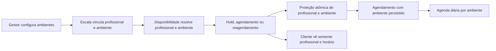

# feat: Agenda por ambientes

## Summary

Trocar a agenda diária de profissional por ambiente, preservando o cliente no fluxo por profissional. Cada escala e agendamento terá ambiente persistido, ordenado e protegido contra conflitos no banco.

---

## Problem Frame

A agenda atual projeta colunas por profissional e só impede sobreposição para o mesmo profissional. A operação precisa administrar a capacidade física: um ambiente não pode atender dois profissionais no mesmo período, mesmo que ambos tenham horários livres.

O cliente continuará escolhendo serviço, profissional, data e horário. Ambiente é dado operacional interno e nunca entra na escolha do cliente.

---

## Requirements

### Cadastro e ordem de ambientes

- R1. Cada ambiente pertence à organização e à unidade ativa, possui nome, ordem de exibição e estado ativo.
- R2. Organizações existentes e novas começam com `Sala/Cadeira 1` e `Sala/Cadeira 2`, nesta ordem.
- R3. Gestor pode adicionar, renomear, reordenar e inativar ambientes sem apagar histórico de escala ou agendamento.

### Escala e disponibilidade

- R4. Todo novo intervalo de trabalho do profissional exige um ambiente ativo.
- R5. Formulário de escala mostra ambientes disponíveis para dia e faixa de horário informados, antes de salvar.
- R6. Um profissional não pode ter dois intervalos simultâneos; dois profissionais também não podem ocupar o mesmo ambiente no mesmo horário.
- R7. Exceção `AVAILABLE_OVERRIDE` exige ambiente ativo disponível; `UNAVAILABLE` não recebe ambiente.
- R8. Novo agendamento manual fora da escala exige escolha explícita de ambiente livre pelo gestor.

### Agendamentos e agenda

- R9. Todo hold, agendamento novo ou reagendado recebe ambiente compatível com a escala do profissional e com todo período do serviço.
- R10. Banco bloqueia sobreposição ativa por profissional e por ambiente, incluindo holds ainda válidos.
- R11. Agenda diária exibe ambientes em colunas, ordenados da esquerda para direita; horários continuam nas linhas verticais.
- R12. Cards exibem profissional, além das informações atuais de horário, cliente, origem e serviço.
- R13. Filtros por profissional e status continuam funcionando sem trocar a estrutura por ambiente.

### Cliente, dados existentes e segurança

- R14. Cliente, fila presencial, App do Barbeiro e reagendamento mantêm escolha por profissional e não expõem ambiente.
- R15. Escalas e agendamentos existentes são distribuídos automaticamente pelo primeiro ambiente livre na ordem configurada.
- R16. Caso a capacidade existente não comporte distribuição válida, sistema não cria ambiente fictício: registra pendência para resolução do gestor e não usa o dado pendente para liberar novas reservas.
- R17. Todas leituras e escritas de ambiente permanecem isoladas por organização e respeitam permissões atuais de gestor e profissional.

---

## Key Technical Decisions

- KTD1. Ambiente será entidade própria por unidade, não texto copiado no profissional. A agenda atual possui `location_id`; vincular ambiente à unidade evita novo redesenho de dados quando houver mais de uma unidade ativa.
- KTD2. Escala aponta para ambiente e agendamento grava o ambiente resolvido. Mudanças futuras de escala ou ordem não alteram local operacional de reservas históricas.
- KTD3. Proteção de capacidade ficará no PostgreSQL. A validação visual ajuda o gestor, mas exclusões e funções transacionais continuam autoridade final contra concorrência.
- KTD4. Seleção automática respeita `sort_order` somente para migração e fluxos sem escolha operacional do gestor. Fora da escala, gestor escolhe ambiente explicitamente.
- KTD5. Inativação substitui exclusão física. Ambiente com histórico permanece consultável; ambiente inativo não aceita nova escala, exceção ou reserva.
- KTD6. Conflitos legados sem capacidade suficiente viram pendência auditável. Não será criado terceiro ambiente nem será sobrescrita reserva existente.

---

## High-Level Technical Design

O mesmo resolvedor de disponibilidade atenderá agenda do gestor, agendamento público, fila e reagendamento. A interface pode antecipar indisponibilidade, mas a transação final revalida todo período e grava o ambiente no mesmo commit.

---

## Implementation Units

### U1. Modelo de ambientes, seed e migração segura

- **Goal:** Adicionar ambientes por unidade, vínculos em escala/agendamento e diagnóstico persistente para alocações legadas sem capacidade.
- **Requirements:** R1, R2, R3, R15, R16, R17.
- **Dependencies:** Nenhuma.
- **Files:** `supabase/migrations/<timestamp>_agenda_environments.sql`, `src/components/connected-manager/types.ts`, `tests/integrations/agenda-environments-migration.test.ts`.
- **Approach:** Criar schema tenant-safe, seed idempotente dos dois ambientes, vínculo com unidade, ordenação estável e inativação. Fazer backfill determinístico por unidade, dia, período e ordem do ambiente; registrar pendência quando a capacidade não comportar a atribuição.
- **Patterns to follow:** Migrations incrementais de `supabase/migrations/`; tabelas com `organization_id`; exclusões GiST existentes em `work_intervals` e `appointments`.
- **Test scenarios:** Seed cria exatamente os dois ambientes padrão; novo ambiente recebe ordem válida; mesma organização não duplica nome ativo na unidade; backfill distribui sobreposições até capacidade; excesso vira pendência sem ambiente artificial; registros de outra organização nunca participam da distribuição.
- **Verification:** Schema preserva histórico, migrations são repetíveis e toda pendência fica identificável ao gestor.

### U2. Resolvedor transacional de capacidade por ambiente

- **Goal:** Resolver e validar ambiente em escala, exceção, hold, agendamento, reagendamento e reserva de fila.
- **Requirements:** R4, R6, R7, R8, R9, R10, R14, R17.
- **Dependencies:** U1.
- **Files:** `supabase/migrations/<timestamp>_agenda_environments.sql`, `tests/integrations/agenda-environments-migration.test.ts`, `tests/integrations/booking-hold-concurrency-migration.test.ts`, `tests/integrations/queue-hold-availability-migration.test.ts`.
- **Approach:** Estender regras de disponibilidade existentes para encontrar ambiente que contenha todo período solicitado. Manter o conflito por profissional e acrescentar conflito ativo por ambiente. Exceção que libera disponibilidade recebe ambiente e valida colisão com escala recorrente, outra exceção e reservas ativas. Fluxo manual fora da escala só prossegue com ambiente escolhido e livre.
- **Patterns to follow:** `get_available_slots`, `create_appointment_hold`, `create_manual_appointment`, `reschedule_appointment` e exclusão `appointments_no_barber_overlap`.
- **Test scenarios:** Serviço atravessando horário indisponível não recebe ambiente; dois profissionais no mesmo ambiente e período são rejeitados; dois ambientes permitem atendimentos paralelos; hold bloqueia ambiente para outra tentativa concorrente; cancelamento libera somente após status deixar conjunto ativo; reagendamento preserva original se novo ambiente não estiver livre; fila não expõe slot sem ambiente.
- **Verification:** Nenhuma rota de escrita consegue criar duas reservas ativas para mesmo ambiente e período.

### U3. Gestão de ambientes nas Configurações

- **Goal:** Permitir configurar quantidade, nome, ordem e estado dos ambientes em Regras de negócio.
- **Requirements:** R1, R2, R3, R16, R17.
- **Dependencies:** U1.
- **Files:** `src/components/connected-manager/server.ts`, `src/components/connected-manager/settings-manager.tsx`, `src/components/connected-manager/types.ts`, `src/components/connected-manager/connected-manager.module.css`, `tests/ui/settings-environments.test.tsx`.
- **Approach:** Carregar ambientes da unidade ativa no mesmo contexto de configurações. Exibir lista ordenável com campo de nome, posição e ação para adicionar ambiente. Mostrar pendências de migração e impedir inativação quando ambiente ainda for necessário para reservas ou escala futura.
- **Patterns to follow:** Formulários e `runMutation` de `settings-manager.tsx`; ordenação por `sort_order` usada no catálogo.
- **Test scenarios:** Novo ambiente aparece na posição escolhida; reordenação altera ordem visível da agenda; ambiente com escala/reserva futura não pode ser inativado sem realocação; pendência legada mostra orientação acionável; gestor de outro tenant não visualiza ou altera ambiente alheio.
- **Verification:** Gestor consegue configurar capacidade sem apagar dados operacionais.

### U4. Escala, exceções e escolha de ambiente

- **Goal:** Tornar ambiente obrigatório e visível para intervalos que liberam atendimento.
- **Requirements:** R4, R5, R6, R7, R8, R17.
- **Dependencies:** U1, U2, U3.
- **Files:** `src/components/connected-manager/server.ts`, `src/components/connected-manager/team-manager.tsx`, `src/components/connected-manager/types.ts`, `src/components/connected-manager/connected-manager.module.css`, `tests/ui/team-manager-environments.test.tsx`.
- **Approach:** Incluir seletor Ambiente à esquerda da ação de adicionar horário. Atualizar opções conforme dia e intervalo, listar ambiente na escala existente e exigir ambiente para exceção que disponibiliza profissional. Manter folga sem ambiente.
- **Patterns to follow:** Modal Escala, exceções e comissão em `team-manager.tsx`; dados carregados por `loadTeamData`.
- **Test scenarios:** Horário novo sem ambiente não salva; ambiente ocupado não aparece como opção válida; horário em ambiente livre salva; exceção indisponível não pede ambiente; exceção disponível exige ambiente; gerente seleciona ambiente ao criar reserva manual fora da escala.
- **Verification:** Escala mostra claramente onde cada profissional pode atender e previne conflito antes de enviar.

### U5. Agenda diária orientada por ambiente

- **Goal:** Projetar a agenda diária por colunas de ambiente sem perder estado visual dos eventos e filtro de profissional.
- **Requirements:** R11, R12, R13, R16.
- **Dependencies:** U1, U2, U3.
- **Files:** `src/components/connected-manager/server.ts`, `src/components/connected-manager/agenda-manager.tsx`, `src/components/connected-manager/agenda-calendar.ts`, `src/components/connected-manager/types.ts`, `src/app/globals.css`, `tests/ui/agenda-calendar.test.ts`, `tests/ui/agenda-environments.test.tsx`.
- **Approach:** Substituir cabeçalho e colunas diárias de profissional por ambientes ordenados. Posicionar cada card pelo ambiente persistido, incluir profissional no conteúdo e manter legenda, cores de status, colisão visual de cancelados e acessibilidade. Reservas pendentes de migração ficam fora da grade física e aparecem como pendência operacional até correção.
- **Patterns to follow:** Geometria real por minuto e `buildAppointmentLayouts` em `agenda-calendar.ts`; estilos `agenda-day` e `agenda-event` em `globals.css`.
- **Test scenarios:** Ordem de colunas segue configuração; evento aparece no ambiente atribuído; profissional é visível no card; filtro de profissional não move evento para outro ambiente; eventos cancelados e substitutos ainda dividem largura; card curto e longo preservam geometria; ambiente sem eventos permanece visível.
- **Verification:** Visão diária expressa ocupação física e mantém legibilidade em desktop, mobile e zoom elevado.

### U6. Paridade dos fluxos de reserva e App do Barbeiro

- **Goal:** Preservar experiência cliente/profissional enquanto backend passa a reservar ambiente.
- **Requirements:** R9, R10, R14, R17.
- **Dependencies:** U2, U5.
- **Files:** `src/components/connected-client/api.ts`, `src/components/connected-client/booking.tsx`, `src/components/connected-client/reservations.tsx`, `src/components/walkin-queue.tsx`, `src/components/connected-barber/agenda.tsx`, `tests/domain/booking.test.ts`, `tests/ui/barber-agenda-manager-layout.test.ts`, `tests/integrations/agenda-environments-migration.test.ts`.
- **Approach:** Manter contratos públicos por profissional e horário; remover da disponibilidade qualquer slot sem ambiente elegível. App do Barbeiro continua exibindo agenda do profissional, sem revelar controles de ambiente que pertencem ao gestor.
- **Patterns to follow:** API cliente `getAvailableSlots`, hold de fila e revalidação final de reserva.
- **Test scenarios:** Cliente vê os mesmos campos e somente horários com ambiente; escolha concorrente falha com mensagem de indisponibilidade e não cria reserva parcial; cliente reagenda sem ver ambiente; fila mantém hold por profissional e reserva ambiente internamente; barbeiro vê apenas próprios atendimentos.
- **Verification:** Cliente e profissional não precisam aprender novo fluxo, enquanto capacidade física é respeitada.

---

## Acceptance Examples

- AE1. Gestor tenta adicionar segunda escala para 09:00–12:00 na Sala/Cadeira 1 quando outro profissional já ocupa esse ambiente no mesmo dia; interface mostra indisponibilidade e banco rejeita tentativa concorrente.
- AE2. Gestor cria `AVAILABLE_OVERRIDE` para profissional fora da escala; precisa selecionar ambiente livre, ou a exceção não é salva.
- AE3. Cliente escolhe profissional e serviço de 45 minutos; horário só aparece se profissional e algum ambiente compatível estiverem livres durante todos os 45 minutos.
- AE4. Dois profissionais atendem às 09:00 em ambientes diferentes; ambos aparecem simultaneamente, cada card na coluna correta.
- AE5. Três reservas legadas simultâneas encontram apenas dois ambientes; duas são distribuídas, terceira aparece como pendência para ação do gestor e não libera nova reserva conflitante.

---

## Scope Boundaries

### Deferred to Follow-Up Work

- Gestão visual completa de múltiplas unidades; a modelagem preserva a unidade atual, mas o painel continua com uma unidade ativa no MVP.
- Relatórios de taxa de ocupação por ambiente, manutenção e custos por sala.
- Exposição de ambiente ao cliente, em mensagens WhatsApp ou em comprovantes.

### Outside This Delivery

- Troca do profissional escolhido pelo cliente por escolha de ambiente.
- Alteração de regras financeiras, assinaturas, pagamentos, comissões ou cancelamento.
- Criação automática de ambientes além dos configurados pelo gestor.

---

## System-Wide Impact

- **Dados:** nova capacidade operacional afeta escalas, exceções, appointments e histórico de disponibilidade.
- **Concorrência:** holds e reservas requerem validação do ambiente no mesmo limite transacional que já protege profissional.
- **Autorização:** gestor administra ambientes; profissional consulta somente agenda permitida; cliente não recebe identificador de ambiente.
- **Compatibilidade:** contratos públicos de agendamento continuam orientados a profissional. Qualquer campo interno de ambiente não deve vazar em respostas públicas.

---

## Risks and Rollout Notes

- Backfill só pode concluir após medir reservas e escalas simultâneas por unidade. Pendências precisam ficar visíveis antes de ativar reservas que dependam do ambiente.
- Ambientes inativos não podem ser alvo de novas reservas, mas continuam em histórico e em cards antigos.
- Regras de disponibilidade devem usar intervalo completo do serviço, não apenas horário inicial.
- Deploy exige migrations e Edge Functions somente se alguma Function passar a depender do novo dado; Vercel deve ocorrer após migrations e testes de contratos de agendamento.
- Validação final precisa incluir cenário autenticado de gestor, cliente, profissional e duas tentativas concorrentes de reserva.

---

## Sources and Research

- `supabase/migrations/202608040001_foundation.sql`: escalas, exceções, appointments e exclusão atual por profissional.
- `supabase/migrations/202608040003_transactional_rpcs.sql`: disponibilidade, criação manual e reagendamento atômicos.
- `supabase/migrations/20260831165234_queue_hold_visible_in_booking_availability.sql`: compatibilidade entre hold de fila e disponibilidade do cliente.
- `src/components/connected-manager/agenda-manager.tsx`: projeção atual da agenda diária.
- `src/components/connected-manager/team-manager.tsx`: modal de escala, exceções e comissão.
