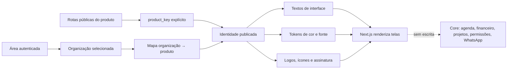

# Identidade visual por produto — mapa para aprovação

**Estado:** aprovado e em implementação. A primeira versão cobre edição e publicação isoladas por produto, upload seguro das logomarcas e aplicação no shell do gestor.

## Objetivo e limite

O administrador escolhe um produto em `/display-admin/identidade-visual`, edita sua apresentação, confere a prévia e publica uma revisão. O mesmo motor de agenda, pagamentos, projetos, clientes e permissões continua em uso. Configurações de apresentação não mudam tabelas de negócio, IDs, rotas técnicas, critérios de elegibilidade, cobranças ou mensagens enviadas pelo WhatsApp.

O cadastro de `professional_functions` e o vínculo opcional `barbers.professional_function_id` já existem como mecanismo de função por profissional. A identidade do produto define o **rótulo genérico** da interface; quando houver função cadastrada, a interface pode mostrar “Fotógrafo” ou “Editor” para aquela pessoa. Isso não altera suas permissões nem o serviço que pode executar.

## Mapa de resolução

1. **Chave estável:** `los-barberos`, `le-gras`, `pro-stetic`, `music-pro`. A rota pública já conhece a chave. Em `/gestor`, `/cliente` e `/barbeiro`, a chave vem da organização ativa; não se deduz do último hostname visitado nem de um cookie de aparência.
2. **Vínculo aditivo:** uma tabela isolada `organization_product_assignments(organization_id, product_key)` aponta cada organização para um produto. Organizações existentes recebem `los-barberos` na migração inicial. Contas ligadas a organizações de produtos diferentes precisam escolher organização antes de receber a identidade. A escolha não muda dados ou permissões.
3. **Configuração isolada:** `platform_product_identity_drafts` (somente administrador) e `platform_product_identities` (revisão publicada) guardam tokens de cor, fontes permitidas, textos de interface, frases e caminhos de assets. Uma publicação copia a revisão validada; rollback seleciona revisão anterior. Nada é salvo em tabelas de agenda, pagamentos ou profissionais.
4. **Assets:** bucket próprio para marcas dos produtos, distinto de `organization-logos`. Upload de PNG/WebP com dimensões e tamanho validados; SVG somente após sanitização/revisão. `organization.logo_path` permanece marca da empresa assinante e não substitui a marca do produto.
5. **Entrega:** configuração publicada é carregada no servidor por produto, validada por schema e aplicada como CSS custom properties e dicionário de textos tipado. Falha de leitura usa preset versionado do produto; o preset atual de Los Barberos permanece referência.
6. **Acesso:** só `platform_admins` edita/publica. Leitura pública expõe apenas a revisão publicada, nunca rascunhos nem segredos. A página administrativa mantém visual Display SH fixo.

**Pré-requisito para edição persistente:** essas tabelas de configuração e o bucket precisam de migration aditiva. É infraestrutura de apresentação no mesmo Supabase; o core e seus fluxos não são alterados.

## 1. Vocabulário: inventário e contrato

Busca bruta em `src/**/*.ts(x)` no estado atual: 88 ocorrências de “barbeiro/a”, 216 de “barbearia(s)” e 55 de “Los Barberos”. Essas contagens incluem texto visível, identificadores técnicos, parâmetros de URL e exemplos; não são 359 substituições automáticas.

| Chave de apresentação | Los Barberos atual | Le Gras proposto | Onde aparece hoje | Regra |
|---|---|---|---|---|
| `brand.name` | Los Barberos | Le Gras | `Brand`, landing, login, metadata, PWA | Identidade do produto; textos legais passam por revisão própria. |
| `organization.singular/plural` | barbearia / barbearias | estúdio / estúdios | onboarding, seletor de empresa, app do cliente, perfil, agendamento | Prever artigos e contrações (`da`, `do`, `nesta`); frases completas para exceções. |
| `professional.generic` | barbeiro | profissional | agenda, equipe, reserva, caixa | Rótulo genérico; função individual vem de `professional_functions`. |
| `professional.appName` | App do Barbeiro | App da Equipe | títulos, login e menu do app do profissional | Muda somente rótulos; rota `/barbeiro` e contrato interno ficam estáveis. |
| `professional.cashLabel` | Caixa do Barbeiro | Caixa do profissional | financeiro e conciliação visual | Não muda ledger, comissão nem liquidação. |
| `client.organizationPicker` | Minhas barbearias | Meus estúdios | home/perfil/troca do cliente | Resolver pelo produto da organização selecionada. |
| `onboarding.createOrganization` | Crie sua barbearia | Crie seu estúdio | apresentação e formulário | Checkout e RPC permanecem idênticos. |
| `brand.tagline` | gestão para barbearias | a definir | junto à marca em `Brand` e login | Texto separado da família de fonte. |

**Primeiras telas para converter:** `src/components/brand.tsx`, `manager-shell.tsx`, `onboarding-flow.tsx`, `connected-client/{state,home,shell,profile,booking}.tsx`, `connected-barber/barber-shell.tsx`, `connected-manager/{team-manager,cash-manager,barber-cash-reconciliation}.tsx`, metadados e manifests. O inventário final classifica cada literal antes de trocar.

**Protegidos:** nomes `barbers`, `BARBER`, `professional_function_id`, `/barbeiro`, `barbearia` como parâmetro técnico, RPCs, tabelas, eventos, políticas RLS e textos de templates/fluxos WhatsApp. Conteúdo jurídico não entra em substituição por variável genérica.

## 2. Cores: quantidade e localização

O CSS versionado contém **30 tokens de cor em `:root`** e **932 valores hexadecimais distintos** espalhados por oito arquivos CSS. Os 932 incluem telas de demonstração, área administrativa antiga e cores pontuais; não correspondem a 932 campos que o administrador deva editar. O plano é mapear esses literais para papéis semânticos onde o produto aparece. A interface oferece campos principais e um painel avançado com os 30 tokens; cores de erro e sucesso mantêm significado e contraste.

| Área CSS | Hex distintos no arquivo | Uso principal |
|---|---:|---|
| `src/app/globals.css` | 300 | landing, login, shell, painel Display SH, componentes globais |
| `connected-manager.module.css` | 312 | telas do gestor |
| `connected-client.module.css` | 214 | app do cliente |
| `control-plane.module.css` | 81 | painel administrativo legado, não base do novo editor |
| `barber.module.css` | 37 | app do profissional |
| `projects.module.css` | 26 | projetos do profissional |
| `legal-page.module.css` | 13 | páginas legais, revisão separada |
| `access.module.css` | 3 | entrada do profissional |

### Tokens existentes

| Grupo / variável | Valor | Papel visual atual |
|---|---|---|
| `--ink`, `--ink-2` | `#16211e`, `#24342f` | texto principal e secundário escuro |
| `--forest-950`, `--forest-900` | `#0e2a24`, `#12352e` | fundo mais escuro, marca e navegação |
| `--forest-800`, `--forest-700` | `#17453a`, `#235b4d` | superfícies/ações verdes escuras |
| `--forest-600`, `--forest-500` | `#2f6b5d`, `#4a8274` | ações, seleção e detalhes |
| `--sage-100`, `--sage-50` | `#dfeae3`, `#edf4ef` | fundos verdes claros e realces |
| `--amber-700`, `--amber-600` | `#9b642c`, `#b97936` | acento escuro e destaques |
| `--amber-500`, `--amber-400` | `#d49a55`, `#e1b46e` | acento principal, marca e foco |
| `--amber-100`, `--amber-50` | `#f4e4cb`, `#fbf4e8` | acento suave e seleção |
| `--paper`, `--paper-2` | `#f7f3eb`, `#f1ece2` | fundo da aplicação |
| `--surface`, `--white` | `#fffefa`, `#ffffff` | cartões e superfícies elevadas |
| `--border`, `--border-soft` | `#e4ded2`, `#ede8df` | divisórias e campos |
| `--muted`, `--muted-2` | `#697570`, `#8c9692` | texto auxiliar |
| `--blue`, `--blue-soft` | `#557385`, `#e6eef1` | estado informativo |
| `--rose`, `--rose-soft` | `#a96464`, `#f4e7e4` | estado rosa suave |
| `--danger`, `--success` | `#a84545`, `#31705d` | erro e sucesso semântico |

**Campos principais sugeridos:** marca primária, marca secundária, acento, fundo, superfície, texto, texto auxiliar, borda, informação, sucesso, alerta/erro e foco. O editor mostra prévia e bloqueia publicação se contraste de texto/controle ficar ilegível. Literais fora dos tokens serão tratados por tela em lotes, começando por landing, login, gestor, cliente e app do profissional.

## 3. Logos e ícones existentes

| Asset / forma | Tamanho do arquivo ou componente | Uso atual | Configuração proposta |
|---|---|---|---|
| `display-sh/wordmark.png` | 255×80 px; cabeçalho exibe a 200 px de largura e 156 px no mobile | marca matriz e páginas futuras | fixo no painel da plataforma; editor da identidade Display SH em fase posterior |
| `display-sh/los-barberos.png` | 242×79 px | card do ecossistema (caixa responsiva com alvo 400×114) | logo horizontal Los Barberos |
| `display-sh/le-gras.png` | 223×73 px | card e hero Le Gras (alvo até 399×114) | logo horizontal Le Gras |
| `display-sh/pro-stetic.png` | 260×81 px | card “Em breve” | logo horizontal ProStetic |
| `display-sh/music-pro.png` | 246×80 px | card “Em breve” | logo horizontal MusicPro |
| `Brand` (`LB` + nome + frase) | símbolo 42×42 px; compacto 38×38 px | login, gestor, cliente, páginas legais | símbolo, nome e frase do produto em camadas |
| `display-admin` (`D`) | símbolo 37×37 px | painel do ecossistema | mantém identidade Display SH |
| `icon.svg`, `icon-192/512/1024.png`, `icon-maskable-512.png` | viewBox 512; 192, 512 e 1024 px | favicon, PWA Los Barberos | variantes por produto, com manifest e metadata próprios |
| `display-sh/icon.svg` | viewBox 64 | PWA/ícone da matriz | fixo para Display SH |
| `los-barberos-instagram.png` | 1254×1254 px | material social estático | inventário de marketing; fora da troca automática da UI |
| `organizations.logo_path` | upload PNG/JPEG/WebP até 2 MB; uso no seletor a 29×29 px | logo de cada assinante | continua por organização, independente da marca do produto |

As marcas PNG atuais incluem subtítulo dentro da imagem (“BARBEARIAS”, “FOTOGRAFIA”, “NEGÓCIOS MAIS FORTES JUNTOS”). Para editar frase isoladamente, a nova versão da marca precisa separar símbolo, nome e assinatura em texto/camadas. Até lá, a troca da frase exige substituir o arquivo inteiro. Para exibição nítida em caixa de 400 px, exportar também variantes em resolução maior.

## 4. Frases e fontes

| Item | Estado atual | Campo no editor |
|---|---|---|
| Assinatura junto à marca | `gestão para barbearias` no componente `Brand`; subtítulos embutidos nos PNGs | frase curta por produto; prévia com/sem marca composta |
| Texto de vendas | frases fixas nas landings (`Uma plataforma...`, `Histórias que ficam...`) | copy das páginas públicas em fase posterior, separado do vocabulário interno |
| Fonte de interface | `--font-sans: Inter, Segoe UI, Roboto...` | seleção de fonte aprovada, com fallback |
| Fonte de títulos | `--font-display: Iowan Old Style, Baskerville, Times New Roman, Georgia...` | seleção de fonte aprovada, com fallback |
| Painel Display SH | corpo `Arial/Helvetica`, títulos serifados | fixo para administração; prévia mostra a fonte do produto |

## Página administrativa proposta

- Navegação: **Identidade visual** → selecionar produto → abas **Vocabulário**, **Cores**, **Logomarcas**, **Frases e fontes**.
- Cabeçalho mostra produto, estado da revisão e ações **Salvar rascunho**, **Publicar**, **Restaurar versão**.
- Cada campo traz nome, valor atual, uso, prévia e erro de validação. Uma coluna lateral simula landing, login, menu gestor e app do cliente sem usar dados reais.
- Alterações em rascunho não aparecem aos usuários. Publicação atualiza somente apresentação daquele produto.
- Painel para Display SH matriz pode reutilizar o editor depois; a primeira entrega cobre os produtos e mantém a interface administrativa fixa.

## Sequência de implementação após aprovação

1. Congelar inventário de literais visíveis por tela; marcar itens técnicos/WhatsApp/jurídicos protegidos.
2. Definir schema tipado de identidade, presets versionados e regras de fallback; criar tabelas isoladas, RLS e bucket de marcas.
3. Vincular organização ao produto sem alterar tabelas transacionais; migrar as organizações atuais para `los-barberos`.
4. Criar resolução do produto no servidor e provider visual no frontend; preservar marca Los Barberos pixel a pixel antes de variar outra marca.
5. Converter primeiro `Brand`, metadata/manifest, landing e login; depois shell gestor, cliente e profissional; extrair textos e cores em lotes auditáveis.
6. Criar editor de Identidade visual com rascunho, prévia, publicação e histórico; validar contraste, dimensões, arquivo e comprimento de texto.
7. Configurar preset Le Gras; em seguida ProStetic. Validar cada produto em público, login e áreas autenticadas. Conferir que agenda, pagamentos, projetos, RLS e mensagens WhatsApp mantêm comportamento atual.

**Dependência real:** hoje `/los-barberos/gestor` encaminha a `/gestor`, enquanto Le Gras tem apenas a landing no checkout atual. O produto autenticado precisa da associação com organização antes de receber identidade própria; a rota de entrada sozinha não sustenta a escolha.
